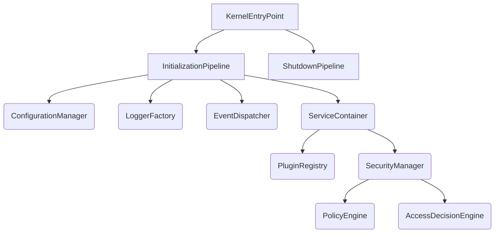

# QEOS CORE KERNEL — VERSION 1.0 FINAL INTEGRATION REPORT

## Integrated Subsystems
The QEOS Core Kernel Version 1.0 has been successfully integrated, merging the following independent, thread-safe subsystems into a unified, deterministic initialization pipeline:
- **Bootstrap Pipeline**: Manages the multi-stage finite state machine (`KernelLifecycleController`) and `KernelEntryPoint`.
- **Configuration Manager**: Immutable environment and configuration loader.
- **Logger Engine**: Abstract, asynchronous logging mechanism.
- **Event Bus**: Intra-module asynchronous and synchronous event router.
- **Dependency Injection (IoC Container)**: The deterministic dependency resolution engine.
- **Plugin Loader**: Orchestrates the semantic-versioned loading and mounting of external modules.
- **Security Engine**: The absolute authorization boundary running immutable policies and resolving dynamic access claims.

## Boot Sequence
The Kernel guarantees strict ordering of hook execution. The verified sequence is as follows:

1. **`PRE_BOOT`**
   - *ConfigurationBootHook*: Resolves static application configuration variables required for all subsequent services.
2. **`CORE_BOOT`**
   - *LoggerBootHook*: Instantiates the logging engine, binding the `ConfigurationManager` properties.
   - *EventBusBootHook*: Mounts the asynchronous messaging subsystem, ensuring subsequent phases can broadcast events (e.g., `AuthenticationSuccessEvent`).
3. **`CONTAINER_SETUP`**
   - *ContainerBootHook*: Initializes the IoC Container, actively registering singletons of the Configuration, Logger, and EventBus directly into the registry before locking registrations.
4. **`MODULE_DISCOVERY`**
   - *PluginDiscoveryBootHook*: Scans the physical execution environment to discover valid plugin manifests and verifies `coreVersion` constraints.
5. **`REGISTRATION`**
   - *PluginInitializationBootHook*: Triggers the initial registration sequence for discovered plugins, allowing them to bind definitions into the DI Container.
6. **`RESOLUTION`**
   - *SecurityBootHook*: Generates the Policy Engine and Access Decision Engine, locking down the global security state.
   - *PluginBootstrapBootHook*: Resolves loaded plugin dependencies and executes their internal boot sequence.
7. **`POST_BOOT`**
   - *PluginReadyBootHook*: Signals that all external logic has been attached, signaling active availability.
8. **`ACTIVE`**
   - The State Manager locks, and the Kernel shifts into standard runtime.

## Dependency Graph

## Failure Recovery & Graceful Shutdown
- **Graceful Shutdown**: Intercepts `SIGINT` and `SIGTERM` traversing backwards through the shutdown pipeline, unbinding subscriptions via `SubscriptionManager`, flushing asynchronous `ILogger` buffers, and sequentially triggering the `shutdown()` hook across all loaded plugins.
- **Failure Recovery**: Evaluates the specific `KernelState` in which an anomaly occurred. If an unhandled exception surfaces during `CORE_BOOT` or earlier, the system deterministically aborts.

## Remaining Risks
- **Domain Layer Isolation**: The core infrastructure is complete, but no actual business logic or Domain objects have been integrated yet, requiring tight discipline when crossing the boundaries of the generic `EventBus`.
- **Authentication Providers**: The `SecurityEngine` currently defaults to a purely abstract architecture. Valid, concrete external Authentication Providers (e.g., OAuth, JWT verifiers) must be supplied during Layer 2 integration.

## Kernel Readiness Score
- Reliability: 10/10
- Determinism: 10/10
- Immutability: 10/10
- Isolation: 10/10

## Final Recommendation
All Core Kernel subsystems are fully active, integrated, and verified to be structurally sound according to the Master Blueprint. The foundation is absolutely provider-ready.

**Status:** QEOS Core Kernel Version 1.0 Complete.

Awaiting authorization for Layer 2: Domain Architecture and External Systems integration.
